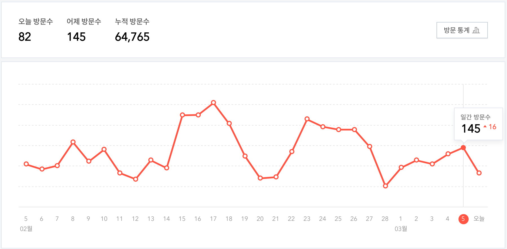

# [블로그](https://www.acmicpc.net/problem/21921)
### 문제
찬솔이는 블로그를 시작한 지 벌써 $N$일이 지났다.

요즘 바빠서 관리를 못 했다가 방문 기록을 봤더니 벌써 누적 방문 수가 6만을 넘었다.

찬솔이는 $X$일 동안 가장 많이 들어온 방문자 수와 그 기간들을 알고 싶다.

찬솔이를 대신해서 $X$일 동안 가장 많이 들어온 방문자 수와 기간이 몇 개 있는지 구해주자.

### 입력
첫째 줄에 블로그를 시작하고 지난 일수 $N$와 $X$가 공백으로 구분되어 주어진다.

둘째 줄에는 블로그 시작 $1$일차부터 $N$일차까지 하루 방문자 수가 공백으로 구분되어 주어진다.

### 출력
첫째 줄에 $X$일 동안 가장 많이 들어온 방문자 수를 출력한다. 만약 최대 방문자 수가 0명이라면 SAD를 출력한다.

만약 최대 방문자 수가 0명이 아닌 경우 둘째 줄에 기간이 몇 개 있는지 출력한다.

### 제한
- $1 \le X \le N \le 250,000$ 
- $0 \le$ 방문자 수 $\le 8,000$ 